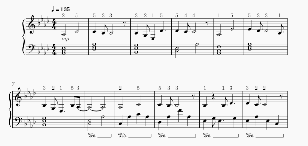
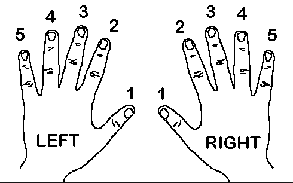
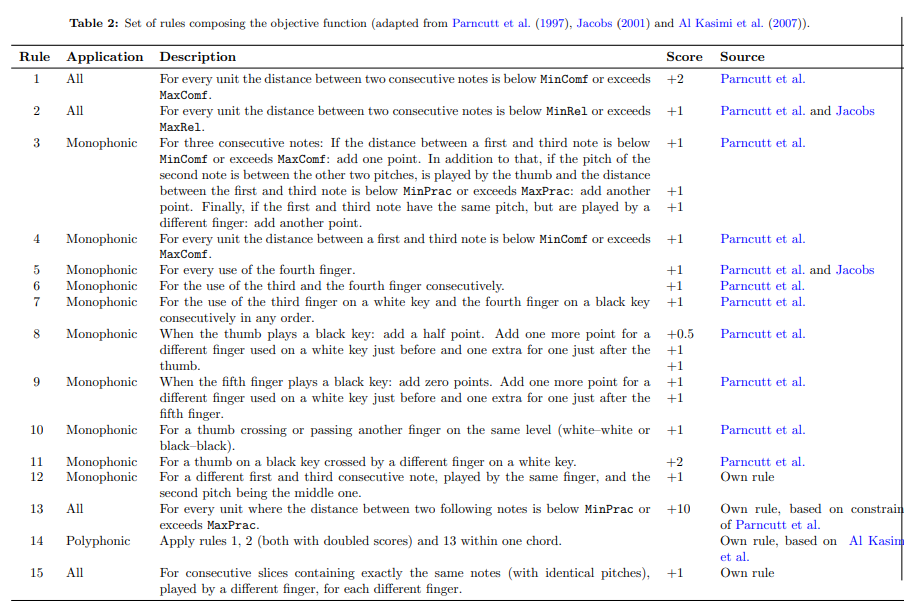

# Fingering Suggestor

A program that suggests fingerings for piano sheet music, currently limited to the right hand. The program requires a MusicXML file as an input.

## Example



_file recieves the fingerings in the top staff_

Once the program is run, a new file named `<SONGNAME>_fingering.musicxml` is created next to the original.

## How it works

Fingers are numbered 1 (thumb) to 5 (pinky):



### 1. Penalties based on finger spans and hand position:

Pianists choose fingerings based on three main things:

- **Expressiveness:** The ability to properly express the piece using the correct fingers.
- **Comfortability:** How easy and comfortable the fingerings are for the hand.
- **Readability and Memorization:** How easy the fingerings are to memorize.

This program currently attempts to maximize comfortability with the use of the span calculated between two fingers. By using the table from _Balliauw et al. (2015)_, adapted from Parncutt's original table for finger spans, we can find the relaxed, comfortable and practical ranges for each pair of fingers.

Parncutt's original table is measured in semitones. This however causes a problem for E-F and B-C as while these are only one semitone apart, every other pair of neighbouring white keys is two semitones apart. Balliauw et al. (2015) solve this by adding two imaginary keys between E–F and B–C, so every pair of neighbouring white keys is two positions apart. Their table is written in these positions.

With those two positions and the adapted table, we are ready to figure out the costs of each span.

### 2. Finding the cost and the cheapest fingering for the whole passage

Table 2 from _Balliauw et al. (2015)_



_This program only uses the monophonic rules. In addition, some rules are changed, such as an increase in penalty to rule 12 and an added penalty for reusing a finger after a hand shift._

The cost is based on common practices when choosing piano fingerings. This includes but is not limited to:

- The use of the fourth finger
- The use of the thumb on a black key
- The consecutive use of the middle finger on a white key and the ring finger on a black key
- The consecutive use of the same finger on two different keys

With spans and costs out of the way, we now need to find the cheapest fingering for the whole passage. The program approaches this problem with dynamic programming. Instead of trying all 5ⁿ possible fingerings, the cheapest way to reach a note using a pair of fingers on the last two notes is stored.

The Idea:

There are 5² = 25 possible ways to finger two notes.

Let's assume three notes, A, B and C. If we want a fingering for C, this program asks for all the 25 possible combinations of B and C (1,1), (1,2), …, (5,5). For each of those possible 25 combinations, it then asks, what is the best finger we could've used for A to get to this combination of B and C? For example, if B and C are fingered with 2 and 3 respectively, then A should be fingered with 1 (assuming that the notes are going up by step) to get the least amount of cost. At the end of the program, the route with the least amount of cost is traced backwards in order to get the fingers.

When choosing the best finger for A, the program also adds a cost for seeing the three notes A, B and C together. Because this movement (going upwards from finger 1 to 3) is comfortable, the three note cost is free.

### 3. Reading the sheet music and writing the fingers in

Uses [music21](https://web.mit.edu/music21/).

Reads the top staff of a MusicXML file. Tied notes and rests are skipped. Once the suggested fingerings are computed, they are written back onto the score as a new MusicXML file.

## How to Use

Requires [uv](https://docs.astral.sh/uv/).

Sheet file requires a tempo marking to fully work as intended.

```
git clone https://github.com/Traelx/Fingering-Suggestor.git
cd Fingering-Suggestor
uv run fingering-suggestor test_songs/<SONGNAME>
```

Put the mxl file in test_songs or pass any path to a .mxl/musicxml file.

## Project structure

```
src/fingering_suggestor/
    __init__.py
    music_import.py #reads score and writes fingerings
    dp.py #suggests fingerings
    cost.py #penalty rules
```

## Limitations

- Only the top staff gets suggested fingers. This causes problems in passages where the melody crosses into the left hand.
- Chords get no fingerings.
- 1-second split: Fingerings reset when more than one second passes between the start of one note and the next, but the threshold may not work for every piece.
- Fingerings are only based on how comfortable each stretch is, not how the passage is played. As such, strange fingerings may be suggested for certain passages.
- Fingerings are most suited for smaller hands.

## References

- Parncutt, R., Sloboda, J. A., Clarke, E. F., Raekallio, M., & Desain, P. (1997). An ergonomic model of keyboard fingering for melodic fragments. _Music Perception_, 14(4), 341–382.
- Jacobs, J. P. (2001). Refinements to the ergonomic model for keyboard fingering of Parncutt, Sloboda, Clarke, Raekallio, and Desain. _Music Perception_, 18(4), 505–511.
- Balliauw, M., Herremans, D., Palhazi Cuervo, D., & Sörensen, K. (2015). A variable neighbourhood search algorithm to generate piano fingerings for polyphonic sheet music. _International Transactions in Operational Research_. https://doi.org/10.1111/itor.12211
